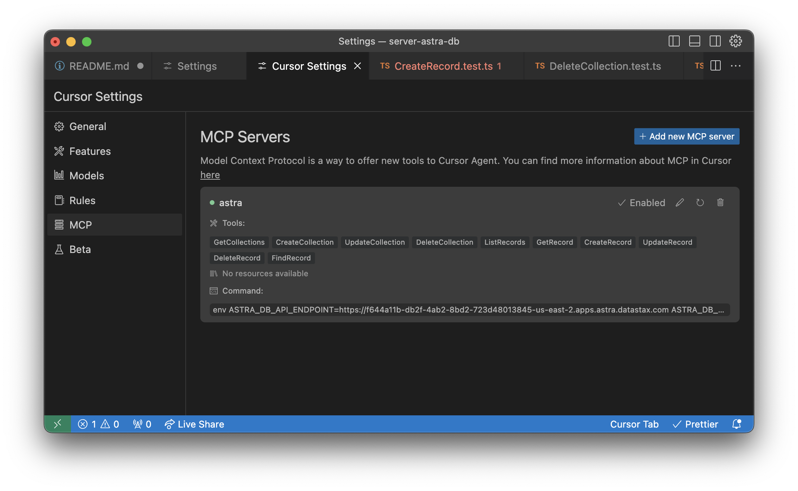

# Astra DB MCP Server

A Model Context Protocol (MCP) server for interacting with Astra DB. MCP extends the capabilities of Large Language Models (LLMs) by allowing them to interact with external systems as agents.

## Prerequisites

You need to have a running Astra DB database. If you don't have one, you can create a free database [here](https://astra.datastax.com/register). From there, you can get two things you need:

1. An Astra DB Application Token
2. The Astra DB API Endpoint

To learn how to get these, please [read the getting started docs](https://docs.datastax.com/en/astra-db-serverless/api-reference/dataapiclient.html#set-environment-variables).

## Adding to an MCP client

Here's how you can add this server to your MCP client.

### Claude Desktop


To add this to [Claude Desktop](https://www.anthropic.com/news/claude-desktop), go to Preferences -> Developer -> Edit Config and add this JSON blob to `claude_desktop_config.json`:

```json
{
  "mcpServers": {
    "astra-db-mcp": {
      "command": "npx",
      "args": ["-y", "@datastax/astra-db-mcp"]
    }
  }
}
```

### Cursor



To add this to [Cursor](https://www.cursor.com/), go to Settings -> Cursor Settings -> MCP

From there, you can add the server by clicking the "+ Add New MCP Server" button and entering the following values:

- Name: Whatever you want
- Type: Command
- Command: `env ASTRA_DB_APPLICATION_TOKEN=your_astra_db_token ASTRA_DB_API_ENDPOINT=your_astra_db_endpoint npx -y @datastax/astra-db-mcp`

Once added, your editor will be fully connected to your Astra DB database.

## Available Tools

The server provides the following tools for interacting with Astra DB:

- `GetCollections`: Get all collections in the database
- `CreateCollection`: Create a new collection in the database
- `UpdateCollection`: Update an existing collection in the database
- `DeleteCollection`: Delete a collection from the database
- `ListRecords`: List records from a collection in the database
- `GetRecord`: Get a specific record from a collection by ID
- `CreateRecord`: Create a new record in a collection
- `UpdateRecord`: Update an existing record in a collection
- `DeleteRecord`: Delete a record from a collection
